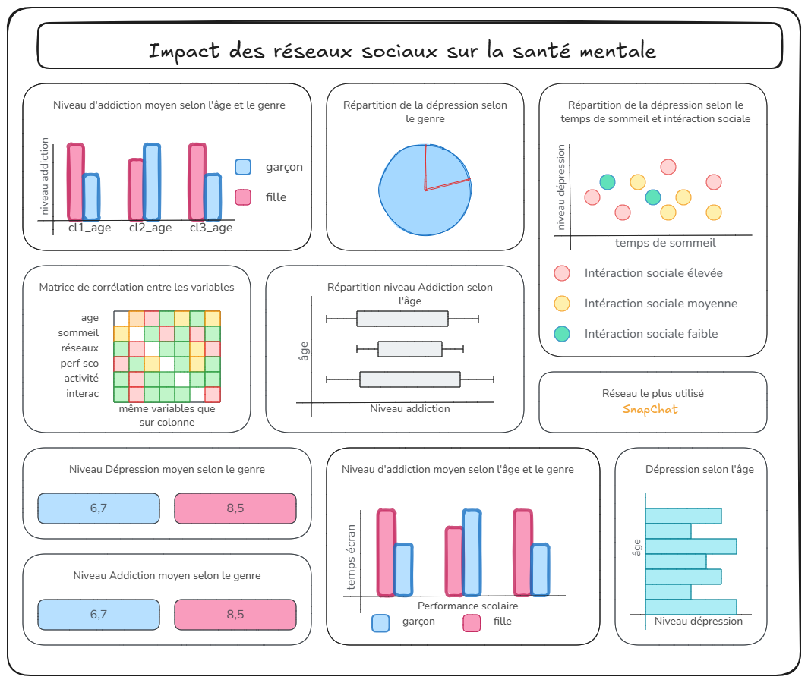

# L'impact des réseaux sociaux sur la santé mentale des adolescents

## 1. Généralité 

***Source :*** [teenager-mental-health](https://www.kaggle.com/datasets/algozee/teenager-menthal-healy)

***Author Name :*** Muhammad Shahzad (Owner of the dataset)

***Volumétrie des données :*** 13col x 1200lig

***Description des données :***

Ce jeu de données recense l'impact des réseaux sociaux sur la santé mentale des adolescents. 

Cette étude est réalisé en prenant en compte différents paramètres comme le temps d'écran moyen avant de dormir, le genre, les réseaux sociaux utilisés, temps de sommeil etc... 

L'objectif de ce jeu de données est d'étudier si une utilisation importante des réseaux sociaux entraîne entre autres des problèmes de santé mentale comme le stress, l'anxiété ou encore la dépression. 

***Pourquoi ce choix ?***

J'ai choisi ce jeu de données car il permet d'explorer des problématiques liées à la santé mentale des adolescents en prenant en compte différents paramètres. 

**<u>Dictionnaire données santé mentale des adolescents<u>**

* <strong>age</strong> : âge des adolescents 

* <strong>gender</strong> : genre des adolescents

* <strong>daily_social_media_hours</strong> : durée journalier d'utilisation des réseaux sociaux

* <strong>platform_sage</strong> : réseau social utilisé

* <strong>sleep_hours</strong> : temps de sommeil par jour

* <strong>screen_time_before_sleep</strong> : temps d'utilisation écran avant de dormir

* <strong>academic_performance</strong> : performance scolaire

* <strong>physical_activity</strong> : niveau d'exercice sportif

* <strong>social_interaction_level</strong> : niveau d'intéraction sociale

* <strong>stress_level</strong> : niveau de stress

* <strong>anxiety_level</strong> : niveau d'anxiété

* <strong>addiction_level</strong> : niveau d'addiction 

* <strong>depression_label</strong> : depréssif ou non

## Objectifs et finalités

L'objectif final de ce projet est de construire un tableau de bord à l'aide de python. Ce tableau de bord devra mettre en avant les paramètres qui jouent positivement ou négativement sur l'état mental des adolescents. 

#### **Quelques axes d'analyses** 

* Comprendre la répartition des personnes en dépression selon le genre, l'âge ou encore l'utilisation des réseaux sociaux.

* Etudier le temps d'utilisation des réseaux sociaux comparé au temps de sommeil. 

* Le niveau d'addiction / dépression selon le plateforme utilisé.

* Matrice de corrélation entre différents paramètres.

* Performance à l'école vs temps de sommeil ou temps passés sur réseaux sociaux. 

* KPI 1 : niveau d'addiction moyen selon le sexe
 

## Schéma - Tableau de bord

